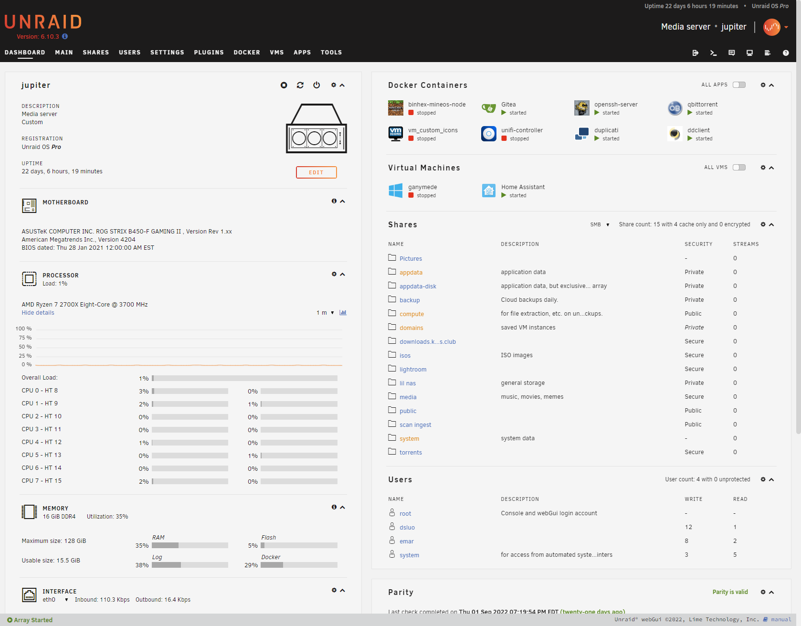
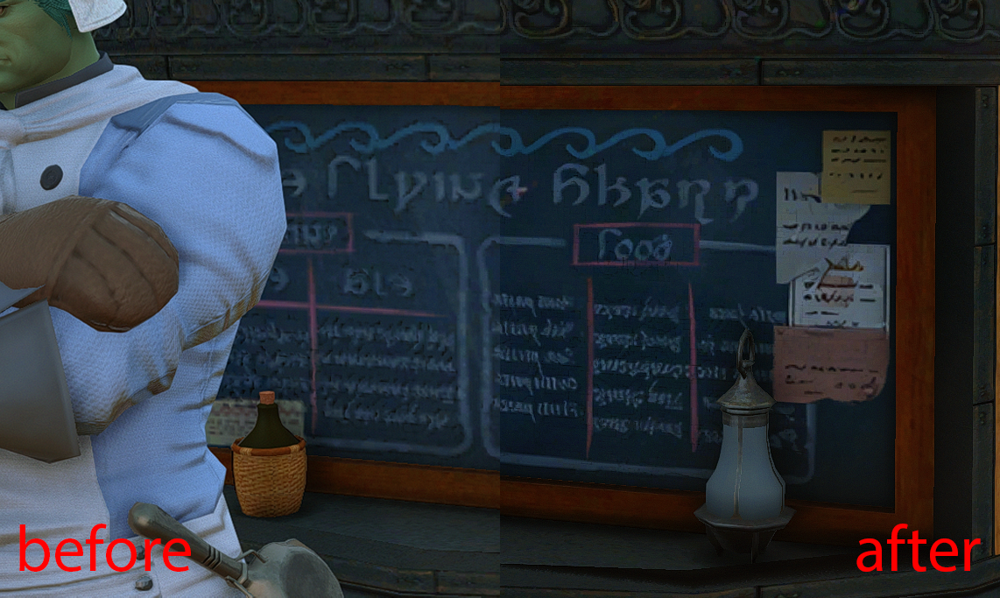

+++
title = "Jupiter, My NAS Server"
date = 2022-09-22T22:23:14-04:00
draft = false
tags = ["Homelab"]
+++

So it's about time I documented what's running on my home network and my plans
for the future. I figure it may be interesting for my future self to look back
on what past me was doing, and perhaps maybe other people will find it
interesting as well.

Now, naturally, with any homelab, I need a naming scheme for my network devices,
and for me, that is the celestial objects in our local solar system. Thus, my
NAS' hostname is `jupiter`, which I'll be writing about in this first part of
this series.

At the time of writing, I'm living in my girlfriend's parent's house while we
wait for our new construction home to be completed, so the current setup is a
bit stripped down, but once that's completed (hopefully sooner rather than
later), there should be more than enough room for activites. But for now, this
will have to do.

# The Machine

So we have a rack mountable ATX case sitting on a dresser with an old monitor
and keyboard sitting on top, next to a box and moving blankets. Perfect.

<!-- todo: the laptop/evolution of setup
Not actually my first home server, but the first one that is theoretically rack-
mountable.
-->

## Specs

`jupiter` has pretty okay hardware, consisting primarily of old desktop
components, along with some more server-specific stuff:

- Rosewill RSV-R4000U 4U Rackmountable Chassis
- Ryzen 7 2700x CPU
- ASUS ROG Strix B450-F Gaming II Motherboard
- 16 GB (2x8 I think) of some brand of DDR4 RAM I don't recall
- A GT 710 video card solely for video output
- 3x 10 TB shucked WD external 3.5" hard drives for the bulk of the storage, using
- LSI 9240-8i SAS HBA flashed in IT Mode for more SATA interfaces, plus
- 2 TB Microcenter store brand NVMe drive for cache, along with
- 1 TB Samsung Evo SATA SSD for redundancy

## What I'm running on it

### Unraid

For the OS, I'm using what many would start off with for a first time with a
NAS: [Unraid](https://unraid.net/). If you're not familiar, Unraid is a
proprietary slackware-based Linux distribution primarily serves as a NAS
operating system, handling RAID (or rather, Unraid's kinda weird version of
RAID), hosting Docker containers and virtual machines, and, of course, network
shares.

For a first "real" RAID setup, Unraid was relatively painless to setup. Put all
the files on a cheap flash drive, stick it in the computer and away we go.
There's a bit of a learning curve, but there is plenty of community support to
make it smoother. Overall, 8/10. Pretty good.

### Self-hosted software

For non-default Unraid stuff, most of my self-hosted software is running in
Docker containers. Currently, I'm running Gitea, for a purpose I'll describe
later; Duplicati for backup to Backblaze B2; and ddclient, which I use for
dynamic DNS with Cloudflare. The sole exception is Home Assistant, which runs in
a virtual machine, as it runs its own Docker containers for its plugin/extension
system.

There's also some miscellaneous services turned off as a result of my
aforementioned living situation, like the `unifi-controller` container - as I'm
currently just plugged in to the ISP-provided router-modem-access-point-switch
combo provided by Comcast to my girlfriend's parents - and a Minecraft server
for whenever my friends feel the urge to return to when we were 14.

# What is it all used for?

Of course, being a NAS, the primary purpose of `jupiter` is to store lots and
lots of files. 30 TB of raw storage across three 10 TB drives; one used for
parity by Unraid, so 20 TB of usable storage. At the time of writing, 7.23 TB of
20 has been filled, mostly consisting of raw and exported photos, backups, and -
most of all - my girlfriend's texture files.

## Textures, textures, textures

While I do spend a lot of time tinkering with this server, the primary user of
the disk space is my girlfriend, who spends her free time upscaling (i.e.
increasing the resolution) of textures for games developed for older, more
resource constrained platforms using AI. Her process produces a very large
amount of data, sometimes *octupling* resolutions, so her hobby gave me an
excuse to spend $400+ on hard drives and engage in mine. It is for her I set up
this NAS in the first place, and she is the primary user of the Gitea instance
running on it, using Git LFS to version control her textures. At some point,
I'll write up on how I used Backblaze and Cloudflare to distribute her files for
only the cost of storage.

<!-- Some of her most popular mods include
one for The Elder Scrolls IV: Oblivion, a game that came out in 2006,
quadrupling the resolution of all textures in the game. More recently, she has
been working on increasing the resolution of all the textures in Final Fantasy
XIV, an MMORPG that was originally developed to be able to run on the
Playstation 3 - a console released almost 12 years ago.

Naturally, all this upscaling produces a lot of data. She is *quadrupling* or
even *octupling* resolutions, after all. And because of her hobby, I had the
excuse to spend $400+ on hard drives and finally dive into building out my own
small scale data center.

The Gitea instance mentioned previously actually serves to version control this
process, using Git LFS to manage the massive files she creates. qBittorrent is
(or at least will be) used to distribute the end result of her process - multi-
gigabyte compressed archives of high-resolution textures, in addition to
uploading to [Nexus Mods](https://www.nexusmods.com/users/629887) and m -->

# Plans

As I've continued to tinker with this machine and my setup in general, I've had
thoughts as to what I can improve.

First and foremost, I'm probably going to be migrating this machine to TrueNAS
for ZFS and its resulting performance benefits. While Unraid is nice for its
flexibilty, it comes at the opportunity cost of read and write, as its
implementation of "RAID" only really provides parity checking and not any of the
performance benefits of reading from multiple drives at once.

Speaking of performance, the next thing I'll probably upgrade is my network.
Currently, I'm using Unifi network hardware, which I will describe in a later
post, but in its current state, it's all 1 gigabit hardware. While 1 gigabit
download speeds may seem fast when downloading from the Internet, it's not
really that fast when you're transfering dozens or even hundreds of gigabytes
of files between comptuers on a local network. I'm currently speccing out what
a 10 gig network would look like, to be upgraded at some point in the next year.

In addition to the TrueNAS migration, I also plan on adding an additional
machine soley for compute. While Unraid has been great as an all-in-one
batteries-included setup, I think the things I want to do with my homelab are
better suited for something more custom, perhaps with a used enterprise-grade
server running Proxmox or just Linux.

# Goodbye

That's it for now. Let's hope I actually keep this up and continue writing
things here.
